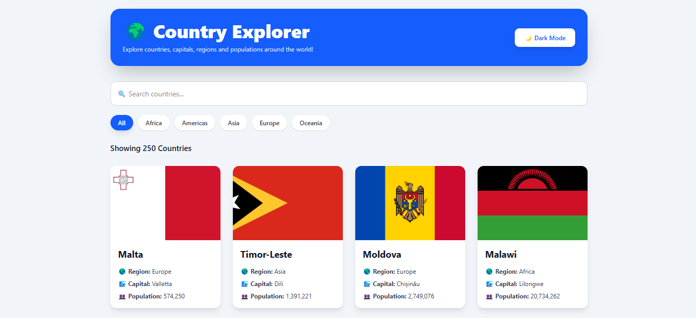
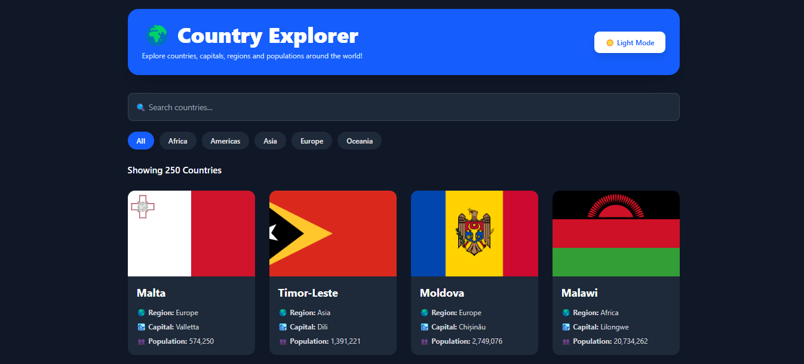
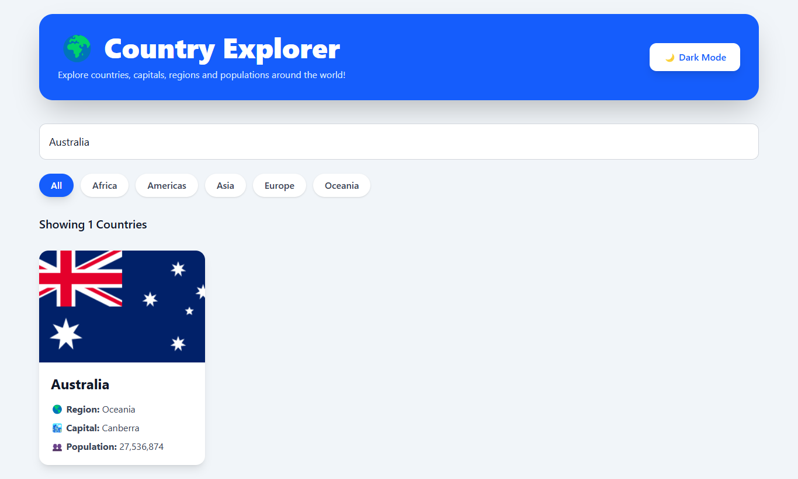
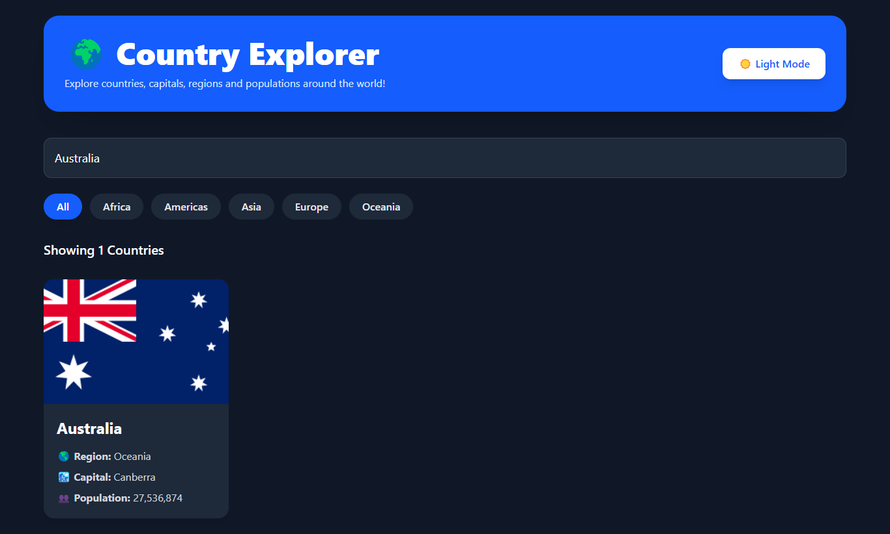
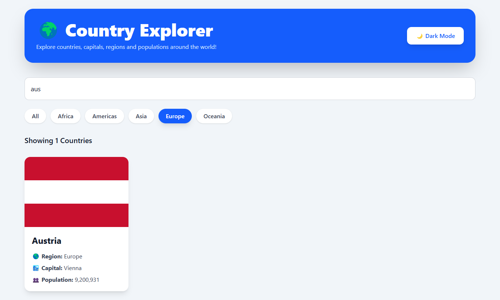
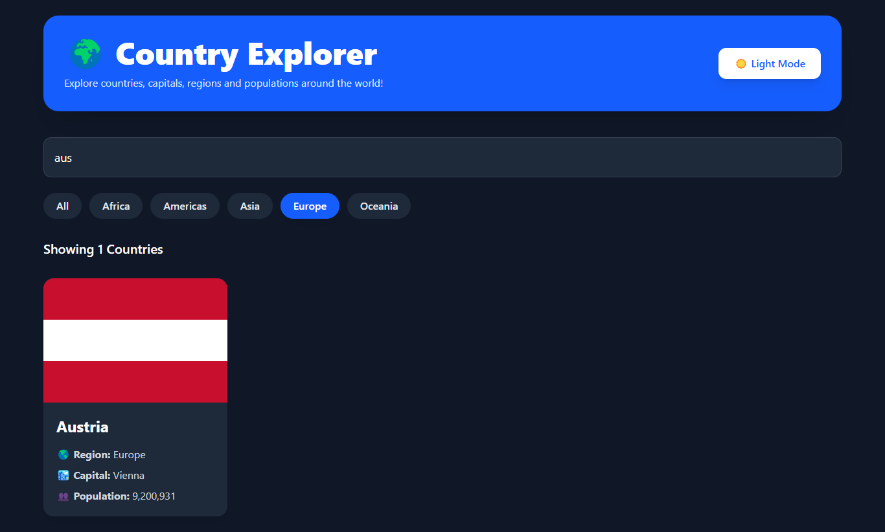
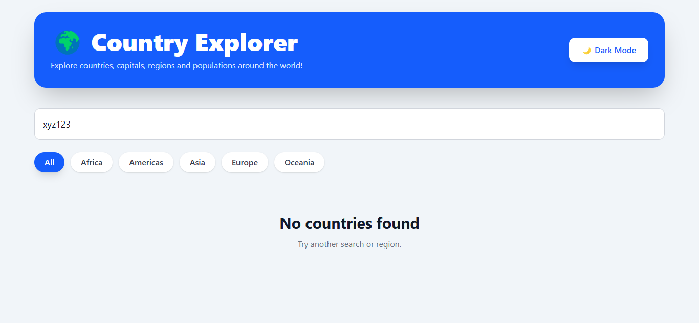
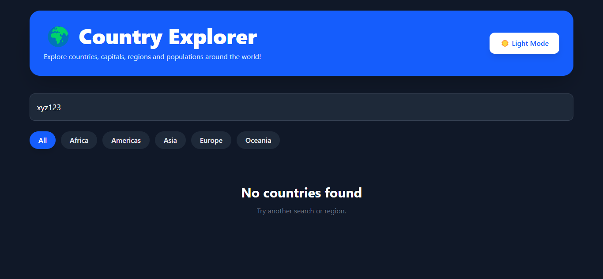

# 🌍 Country Explorer

A responsive Country Explorer web application built with **React**, **TypeScript**, **Vite**, and **Tailwind CSS** as part of the **Coding Pixel Full-Stack Internship Program – Week 4**.

The application fetches country data from the REST Countries API and allows users to search countries by name, filter them by region, and switch between **Light Mode** and **Dark Mode** through a modern, responsive interface.

---

## 📸 Screenshots

### 🏠 Home (Light Mode)



### 🌙 Home (Dark Mode)



### 🔍 Search (Light Mode)



### 🌙 Search (Dark Mode)



### 🌎 Region Filter (Light Mode)



### 🌙 Region Filter (Dark Mode)



### 📭 Empty State (Light Mode)



### 🌙 Empty State (Dark Mode)



---

## ✨ Features

- Fetch country data from the REST Countries API
- Search countries by name
- Filter countries by region using interactive filter buttons
- Light Mode / Dark Mode
- Loading state while fetching data
- Error state for failed requests
- Empty state when no countries match the search
- Responsive country card layout
- Country counter displaying filtered results
- Hover animations on country cards
- Population formatted using `toLocaleString()`
- React Context for state sharing
- Custom Hook (`useCountries`) for data fetching
- Responsive UI built with Tailwind CSS
- TypeScript throughout the project

---

## 🛠 Technologies Used

- React
- TypeScript
- Vite
- Tailwind CSS
- React Hooks (useState, useEffect, useContext)
- Context API
- Custom Hooks
- REST Countries API
- HTML
- CSS
- npm

---

## 📁 Project Structure

```text
react-country-explorer/
├── screenshots/
│   ├── home-light-mode.png
│   ├── home-dark-mode.png
│   ├── search-light-mode.png
│   ├── search-dark-mode.png
│   ├── region-filter-light-mode.png
│   ├── region-filter-dark-mode.png
│   ├── empty-state-light-mode.png
│   └── empty-state-dark-mode.png
│
├── src/
│   ├── components/
│   │   ├── CountryCard.tsx
│   │   ├── CountryGrid.tsx
│   │   ├── ErrorMessage.tsx
│   │   ├── Header.tsx
│   │   ├── Loading.tsx
│   │   ├── RegionFilter.tsx
│   │   └── SearchBar.tsx
│   │
│   ├── context/
│   │   ├── FilterContext.tsx
│   │   ├── ThemeContext.tsx
│   │   └── filter-context.ts
│   │
│   ├── hooks/
│   │   └── useCountries.ts
│   │
│   ├── types/
│   │   └── Country.ts
│   │
│   ├── App.tsx
│   ├── index.css
│   └── main.tsx
│
├── public/
├── package.json
├── tsconfig.json
├── vite.config.ts
├── eslint.config.js
└── README.md
```

---

## 🧩 Components

### App

The root component responsible for:

- Rendering the application
- Using the `useCountries` custom hook
- Managing loading, error, and success states
- Rendering the header, search bar, region filter, and country grid

### Header

- Displays the application title
- Provides the Light/Dark Mode toggle

### SearchBar

- Controlled search input
- Filters countries by name

### RegionFilter

- Interactive region filter buttons
- Uses React Context

### CountryGrid

- Displays filtered countries
- Shows the number of matching countries
- Handles the empty state

### CountryCard

Displays:

- Country flag
- Country name
- Capital
- Region
- Population

### Loading

Displays a loading spinner while data is being fetched.

### ErrorMessage

Displays an error message when the API request fails.

---

## 📄 Data Model

```typescript
export interface Country {
  cca3: string;

  name: {
    common: string;
  };

  capital?: string[];

  population: number;

  region: string;

  flags: {
    png: string;
    svg: string;
  };
}
```

---

## ⚛ React Concepts Practiced

- Functional Components
- JSX
- TypeScript
- Props
- useState
- useEffect
- useContext
- Context API
- Custom Hooks
- Controlled Inputs
- Conditional Rendering
- List Rendering
- Component Composition
- Theme Management
- UI State Management
- Responsive Design
- Conditional Styling

---

## 🪝 Custom Hook

The application fetches data using a reusable custom hook:

```typescript
function useCountries(): {
  data: Country[];
  loading: boolean;
  error: string | null;
};
```

The hook is responsible for:

- Fetching data from the REST Countries API
- Managing loading state
- Managing error state
- Returning fetched country data
- Cleaning up requests using AbortController

---

## 🌐 Context API

The application uses:

- **FilterContext** for managing search text and selected region.
- **ThemeContext** for managing Light Mode and Dark Mode across the application.

This avoids prop drilling and keeps global UI state centralized.

The contexts manage:

### FilterContext

- Search text
- Selected region
- Updating search
- Updating region

### ThemeContext

- Current theme
- Theme switching between Light Mode and Dark Mode

---

## 🎯 Week 4 Requirements Implemented

- Fetch data using a custom hook
- Loading state
- Error state
- Empty state
- Search functionality
- Region filter
- Context API
- useEffect with dependency array
- AbortController cleanup
- Responsive Tailwind layout
- Population formatted using `toLocaleString()`
- Stable React keys using `cca3`
- Clean component structure
- Dark Mode / Light Mode
- Interactive region filter buttons
- Responsive modern UI
- Hover animations
- Country counter

---

## 🚀 Installation

Install project dependencies:

```bash
npm install
```

---

## ▶ Run Development Server

```bash
npm run dev
```

Open the local development URL shown in your terminal.

---

## ✅ Run ESLint

```bash
npm run lint
```

---

## 📦 Build Project

```bash
npm run build
```

---

## ✔ Week 4 Acceptance Checklist

- [x] Built with React, TypeScript, and Vite
- [x] Tailwind CSS implemented
- [x] Data fetched inside a custom hook
- [x] Loading state
- [x] Error state
- [x] Empty state
- [x] Search functionality
- [x] Region filter
- [x] Context API
- [x] useEffect
- [x] AbortController cleanup
- [x] Responsive layout
- [x] Population formatted using `toLocaleString()`
- [x] Stable React keys
- [x] Light Mode / Dark Mode
- [x] Interactive region filter buttons
- [x] Country counter
- [x] Hover animations
- [x] Project builds successfully
- [x] ESLint passes without errors

---

## 🚀 Future Improvements

- Add a country details page
- Display neighboring countries
- Add sorting by name and population
- Add pagination or infinite scrolling
- Add favorites/bookmarks
- Improve accessibility (ARIA labels and keyboard navigation)
- Add unit and integration tests

---

## 🎓 Internship

**Coding Pixel Full-Stack Internship Program**

**Week 4 – React Hooks, Context API & Tailwind CSS**

---

## 👨‍💻 Author

**Muhammad Haris**

GitHub: https://github.com/hariskhan-136
